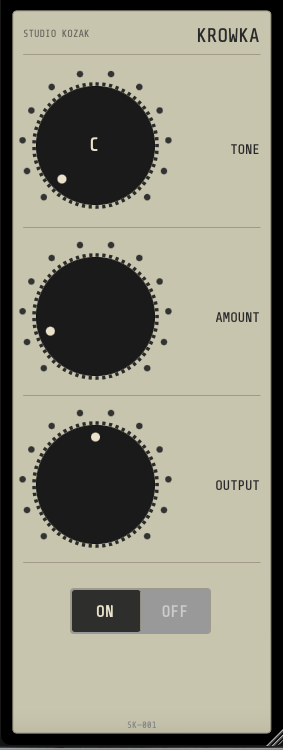

  

# SK-Krowka
A little Polish candy for crowded low-mids.

  

## Overview

SK Krowka is a Mid/Side phase processor designed to help reduce the perception of congestion in the low-mid range.

In many mixes, the area between approximately 150 Hz and 500 Hz accumulates energy from vocals, guitars, keyboards, reverbs and supporting instruments. This buildup can make a mix feel crowded, less open and harder to listen to.

Rather than relying on conventional equalization, SK Krowka uses a musically tuned phase process. Its goal is not to remove frequencies, but to help them coexist more comfortably.

The result can be a mix that breathes more naturally, feels more spacious and is simply more enjoyable to listen to.

SK Krowka is available in VST3 format (Windows and macOS) and Audio Unit (AU) format (macOS).

---

## Why "Krowka"?

*Krowka* is a traditional Polish caramel candy enjoyed by generations of people.

The plugin was named after it because it follows a similar philosophy: not to transform a mix dramatically, but to make it a little more enjoyable.

If a mix feels clearer, more open and simply puts a slight smile on your face, Krowka has probably done its job.

---

## How It Works

SK Krowka is based on the notes of the chromatic scale.

The selected note determines the reference frequency used by the algorithm. The processing then operates around that note and its harmonics within the low-mid region.

This allows the processor to be adapted to the musical key rather than an arbitrary frequency setting.

---

## Controls

**TONE**

Selects the musical note used as the processing reference.

C C# D D# E F F# G G# A A# B

Recommended Method

If you know the key of the song, start by selecting that note.

Examples:

* A minor song -> A
* D major song -> D
* G minor song -> G

This usually provides the most natural and musically coherent results.

You may then experiment with neighboring notes to fine-tune the effect.

If the key is unknown

Simply audition the different positions and choose the one that provides the greatest sense of openness, clarity and listening comfort.

---

**AMOUNT**

Controls the processing intensity.

* Low: subtle and transparent
* Medium: noticeable enhancement
* High: stronger and more creative effect

For mix bus applications, moderate settings are usually recommended.

---

**OUTPUT**

Adjusts the output level.

Use this control to maintain equal loudness when performing A/B comparisons.

---

**ON / OFF**

Engages or bypasses the processing.

Regular comparisons remain the best way to evaluate the effect objectively.

---

## Typical Applications

SK Krowka may work particularly well on:

* Mix bus
* Guitar buses
* Keyboard buses
* Synthesizers
* Pads
* Reverb returns
* Dense arrangements suffering from low-mid congestion

It can also be used creatively on individual tracks.

---

## System Requirements

**Windows**

* Windows 10 or later
* VST3 compatible host
* VST3 format

**macOS**

* macOS 11 Big Sur or later
* Intel or Apple Silicon
* VST3 and Audio Unit (AU) formats
* Compatible VST3 or Audio Unit host

---

## Installation

**Windows**

Copy:

**SK_Krowka.vst3**

to:

`C:\Program Files\Common Files\VST3`

Then restart your DAW.

**macOS**

*VST3 Version*

Copy:

**SK_Krowka.vst3**

to:

`/Library/Audio/Plug-Ins/VST3`

*Audio Unit Version*

Copy:

**SK_Krowka.component**

to:

`/Library/Audio/Plug-Ins/Components`

Then restart your DAW.

---

## Notes

SK Krowka primarily affects spatial perception and phase relationships within the low-mid region.

The audible result depends on the material being processed. On some mixes the effect may be subtle, while on others it can be immediately noticeable.

SK Krowka is not intended to replace an equalizer. It is a complementary tool that approaches low-mid congestion from a different angle.

---

*Stéphan (Studio Kozak)*
